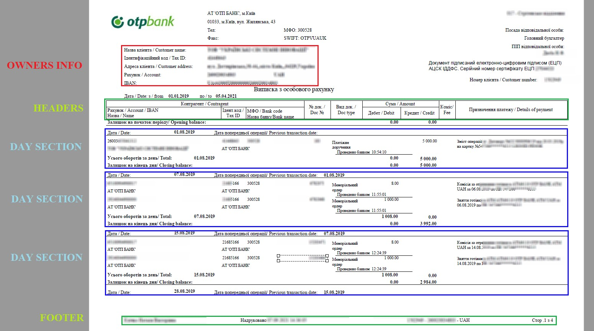
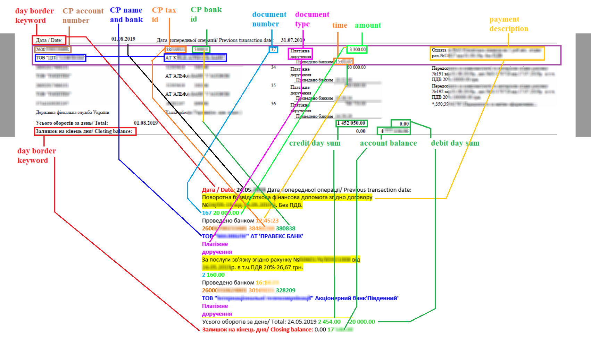
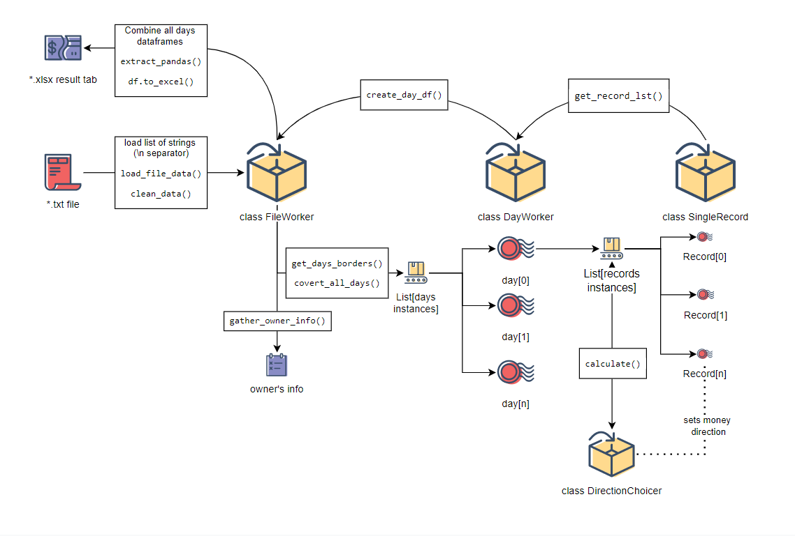

#Parsing textual unstructured data (bank statement)

## Subject description

### Goal
Get a structured table with the ability to sort and filter data (for simple office use).

###Original PDF file

Bank statement in PDF format. The data does not have a tree or column structure. Payments are grouped by day and 
have a separate header. Information about the account's owner and his details in the file header. Also in the 
file there are technical lines: rudiments of column headers, footers, running titles. Each daily section contains 
several transaction records.

###Input file in text representation
The data is retrieved by "copy-paste" or a suitable parser from PDF file. The text view shows the relative position of 
the bank transaction records. The body of the document contains transaction records grouped by day.


###Recovery payment's direction
In the original document, payment's direction (debit or credit) was determined by the position of 
the value in the corresponding column, which was lost during conversion. One of the possible ways to solve the 
problem is the grouping of daily payments into two groups in which the amounts of the groups will correspond to 
the total amount of debit and credit. The solution may not be suitable for demanding consumers.

Known Values:

| Day records | Amount | Debit | Credit | 
| :---: | :---: | :---: | :---: |
| Payment 1 | 245.00 | ? | ? |
| Payment 2 | 100.00 | ? | ? |
| Payment 3 | 334.00 | ? | ? |
| Payment 4 | 12.50 | ? | ? |
| **Day result** | **691.50** | **579.00** | **112.50** |

Right filled tab:

| Day records | Amount | Debit | Credit | 
| :---: | :---: | :---: | :---: |
| Payment 1 | 245.00 | ```245.00``` | - |
| Payment 2 | 100.00 | - | ```100.00``` |
| Payment 3 | 334.00 | ```334.00``` | - |
| Payment 4 | 12.50 | - | ```12.50``` |
| **Day result** | **691.50** | **579.00** | **112.50** |

##Application architecture
